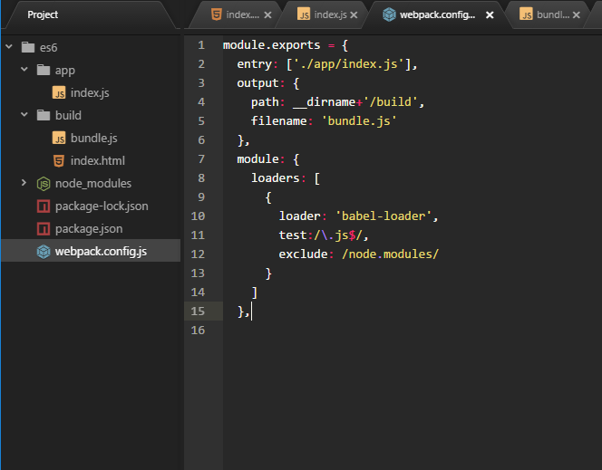
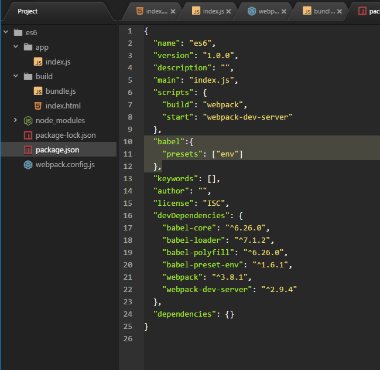

# Setting-up-ES6-environment
How to set up your es6 environment using babel and webpack. Im running windows 10 and I'm using the Atom script editor

# 1-First install node js
make sure not to use the latest version, instead use the second latest so you dont run into problems installing Babel.
Test node js on your cmd by running 
    
            $ node -v
            
If installed correctly this will print the current version you are running
    
            //v8.9.1
    
Test your npm by running

            $ npm -v
    
which should print out the version you are running
            
            //5.4.2
    
 # 2-Set up webpack
 on your cmd make a new folder by running
            
            $ mkdir es6
            
 then enter folder
 
            $ cd es6
            
 then with the npm command we will create a node project with a package.json file
 
            $ npm init -y
            
 which will print the contents of the file on the command prompt, this file being a JSON object
 
            {
          "name": "es6",
          "version": "1.0.0",
          "description": "",
          "main": "index.js",
          "scripts": {
            "test": "echo \"Error: no test specified\" && exit 1"
          },
          "keywords": [],
          "author": "",
          "license": "ISC"
          }
      
then we will install our first dependency 'Webpack'

            $ npm install --save-dev webpack
            
as that installs, it will create a node modules folder for our node project and also 
update our package.json with a dev dependency property which will specify that we need webpack
on this project.

# 3. Open project on your code editor
Here you will see the es6 folder you created, inside it will have a folder with node_modules
and a package.json file

# 4. Create a new folder inside es6 called build, whithin build create your first file, index.html. 
Set up a html document. In the body create a script tag with the source bundle.js

            <!DOCTYPE html>
              <html>
                <head>
                  <meta charset="utf-8">
                  <title>ES6</title>
                </head>
                <body>
                
                    

                </body>
              </html>

# 5. create an app folder within the es6 folder
inside that, create an index.js file. In the index.js 
file write a console.log string to test

                console.log('Hi mum! ...dont worry im never moving out');
    
# 6. Create a config file
To get webpack working we need to create a webpack.config.js file and inside
it place this code.

                module.exports = {
                  entry: ['./app/index.js'],
                  output: {
                    path: __dirname+'/build',
                    filename: 'bundle.js'
                  }
                }
    
    
# 7. Update scripts- 
go back into package.js file, inside "scripts", delete this line

                "test": "echo \"Error: no test specified\" && exit 1"
      
   and replace it with 
      
                "build": "webpack"
      
# 8. Test if webpack works from your cmd
                
                $ npm run build
    
   this will create a bundle.js file in build (dont worry about this file)
    
# 9. Test if its all linked up
open project in browser and inspect the element Ctrl+shift+i to see if your console.log 
comment has printed on the console.

# 10. Add Babel to project. 
On the cmd prompt run

    $ npm babel-core babel-loader webpack-dev-server babel-preset-env babel-polyfill --save-dev
    
   if this does not work, downgrade your version on node/npm https://github.com/expo/expo/issues/297
    https://github.com/npm/npm/issues/18380
    
   what each of these does
        babel-core. Main module which holds much of the logic for transforming es6 to javascript code
        babel-loader. the module that accomplishes the transformation
        babel-preset-env. allows us to specify as a preset
        babel-polyfill. Enables es6 and babel code to run natively on browsers even though not all browsers support es6
        webpack-dev-server. Allows us to have AUTOMATIC LIVE CODE UPDATES
        
# 11 Update our webpack.config.js file 
to include new features. Next to the module.exports create a new object called module, inside it place a loaders array
and within loaders specify our objects, loader:'babel-loader', test:/\.js$/ ---this captures all
our js files, so we need to exclude the node_modules folder, exclude:/node_modules/ like so...
        
          module: {
              loaders: [
                {
                  loader: 'babel-loader',
                  test:/\.js$/,
                  exclude: /node.modules/
                }
              ]
            },
    
  then next to the module object create another object called devServer with 3 things in it
  
              devServer: {
                  port: 3000,               // creates a local port to preview our code
                  contentBase: './build'    //our build folder
                  inline: true              //allows us to run an AUTOMATIC LIVE CODE UPDATE
              }

      
 Now it should be looking like this...
 
   
 
 # 12. UPDATE package.json. again
 Next to the fist object add a babel property, and within it add a presets 
 property with an array of "env" in it
 
                  "babel":{
                    "presets": ["env"]
                  },

 then add one more script, inside "scripts" called 
 
                    "start": "webpack-dev-server"
 
 it should then look something like this...
 
 
   
 
 
 # 13.test it on cmd, run
 
                    $ npm start
        
 # 14.Test that shit 
 Go back to browser, and change it to localhost:3000 to see if it updates and TADAAAAAAA! 
 you're ready to get some shit done!
 
 # 15. Call mum and tell her the good news!
 
 
 
 
 
 
 
 
 
 
 
 
 
 
 
 
 
 
 
 
  
    
